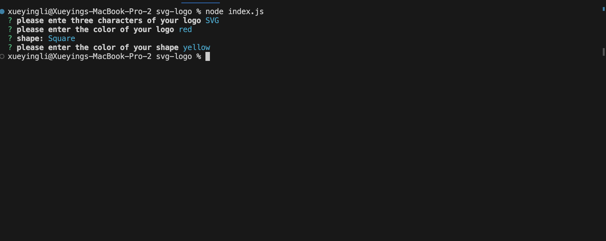

# svg-logo

# Description
In this project, a SVG Logo maker is created. The user will be able to generate a SVG logo based on the questions they answer.

# Installation
# Usage
When user try to generate a SVG logo, they need to run the index.js first and answer the questiones showed up, a logo.svg file then will be created after answering all the questions. 

# links
Github repository: https://github.com/snowlxy1202/svg-logo
Demo URL: https://drive.google.com/file/d/1WgtlqDkqI1l4KB1akG1u8lGs2BlGpFdD/view

# Screenshots

